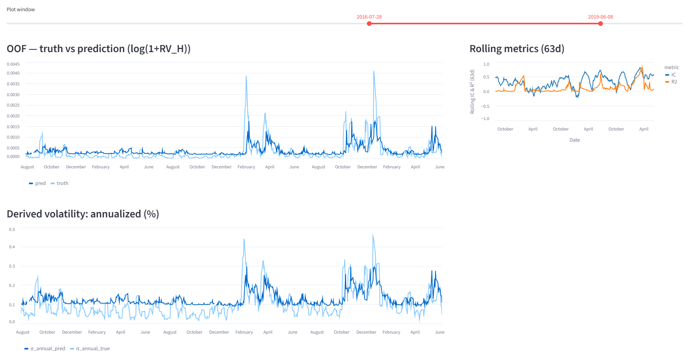
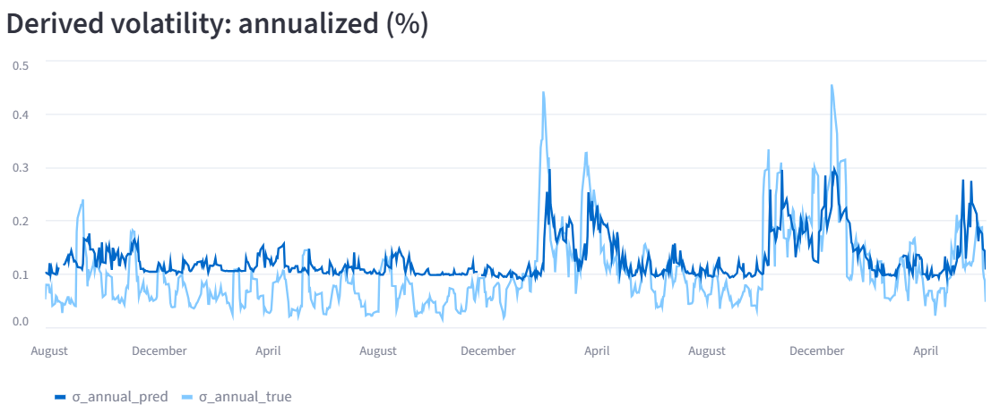
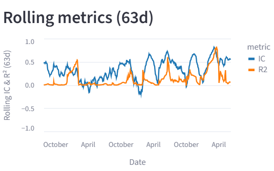

# Volatility Nowcasting from Market Data + News

[](LICENSE)

[](https://github.com/ingo-stallknecht/volatility-nowcasting/actions/workflows/tests.yml)
[](https://github.com/ingo-stallknecht/volatility-nowcasting/actions/workflows/ci.yml)
[](https://volatility-nowcasting-amnkt4qrxfduzwsmwwdbca.streamlit.app/)


Predicting **short-horizon S&P 500 volatility** (`H=5` trading days) by combining **market features** (returns, realized vols, price ranges) with **daily-pooled news signals** (FinBERT sentiment + embeddings).

This project demonstrates:
- **End-to-end pipeline**: data processing → feature engineering → model training → evaluation
- **Leakage-safe cross-validation** (expanding time splits with embargo)
- **Interpretability**: converting realized variance into daily & annualized σ (%)
- **Deployment**: interactive **Streamlit app** + CI checks
- **Reproducibility**: lightweight **Dockerfile** included for containerized runs

---

## Live Demo

**Streamlit App:** [Live link here](https://volatility-nowcasting-amnkt4qrxfduzwsmwwdbca.streamlit.app/)

**Colab Notebook:** [Notebook link here](https://colab.research.google.com/github/ingo-stallknecht/volatility-nowcasting/blob/main/notebooks/volatility_nowcasting.ipynb)

*Screenshot of the app interface:*


---

## Problem Statement

Financial markets are highly dynamic, and **near-term volatility forecasting** is central to:
- **Risk management** (e.g., VaR, capital buffers)
- **Trading strategies** (volatility arbitrage, hedging)
- **Derivatives pricing** (options, structured products)

The task:
> Estimate **realized variance (RV)** over the next **H trading days** (here `H=5`)
> using both **market data** and **textual news sentiment**.

We model **log(1 + RV)** for stability and transform back into volatility for interpretation.

---

## Data Science Approach

This project goes beyond a demo dashboard and follows a rigorous ML pipeline.

- **Data**
  - S&P 500 daily returns, realized volatility, high-low ranges
  - Daily-pooled news sentiment + embeddings from FinBERT

- **Target**
  - Realized variance over `H=5` trading days
  - Modeled as log(1+RV_H) to stabilize skewed distribution

- **Validation**
  - **Expanding-time cross-validation** with embargo
  - Avoids look-ahead leakage from overlapping horizons

- **Metrics**
  - **R² (fit to magnitude)**
  - **IC (Spearman rank correlation, ordering skill)**
  - **QLIKE (robust volatility loss)**

- **Interpretation**
  - Convert back to volatility:
    - σ_daily = √(RV_H / H)
    - σ_annual ≈ σ_daily × √252

For full details, see the [notebooks/volatility_nowcasting.ipynb](notebooks/volatility_nowcasting.ipynb).

---

## Key Features

- **Hybrid feature set**: market data + news sentiment
- **Robust validation**: embargoed expanding-time CV
- **Interactive dashboard**:
  - OOF truth vs prediction
  - Derived daily & annualized volatility
  - Rolling 63-day IC & R²






---

## Preview of Results

**Latest next-H-day forecast** (example values):
- Annualized σ (H=5): **17.9%**
- RV_H ≈ 0.000637
- σ_daily ≈ 1.13%

---

## How to Run Locally

Clone the repo, install dependencies, and run the app:

```bash
git clone https://github.com/ingo-stallknecht/volatility-nowcasting.git
cd volatility-nowcasting
pip install -r requirements.txt
streamlit run app.py
